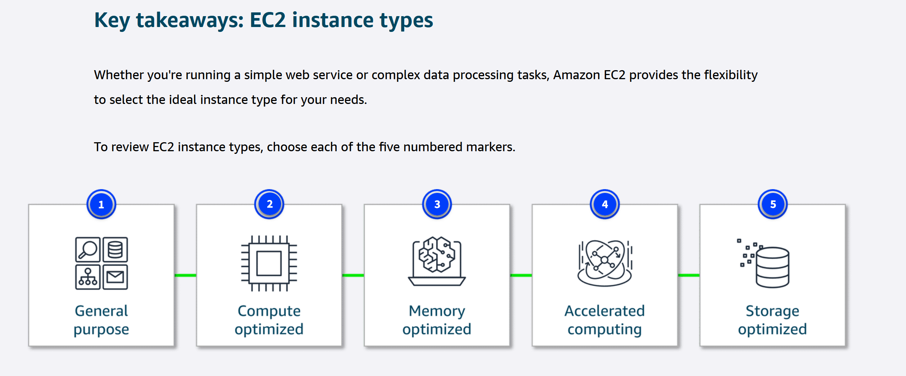

## Amazon EC2 Instance Type

In this lesson, you will learn how to do the following:

  *  Explain the different EC2 instance types and their characteristics.

  * Identify appropriate use cases for each EC2 instance type.

Amazon EC2 offers a broad range of instance types, each tailored to meet specific use case requirements. These instances come with varying combinations of CPU, memory, storage, and networking capabilities, so you can choose the right mix of resources to optimize performance for your applications.

