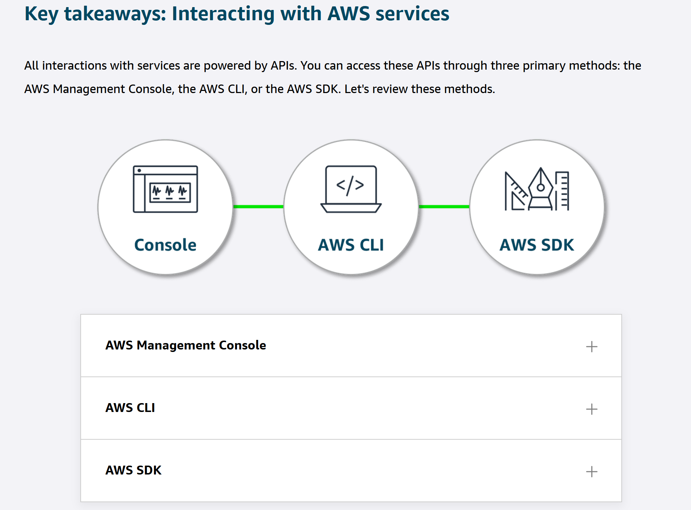

## AWS Resource Provisioning Guidelines

In AWS, tasks such as launching an EC2 instance, stopping an instance, or modifying instance settings are done through API requests. APIs provide predefined methods to interact with, manage, and configure AWS resources efficiently. In this lesson, you will learn about the three main ways to call AWS APIs.

