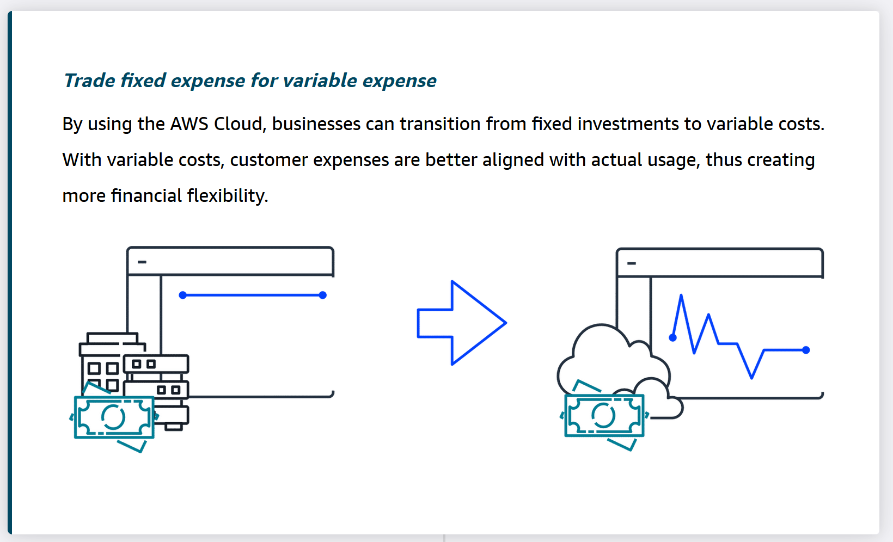
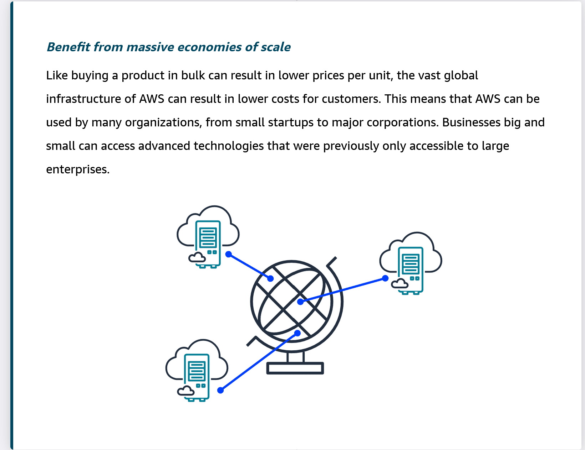
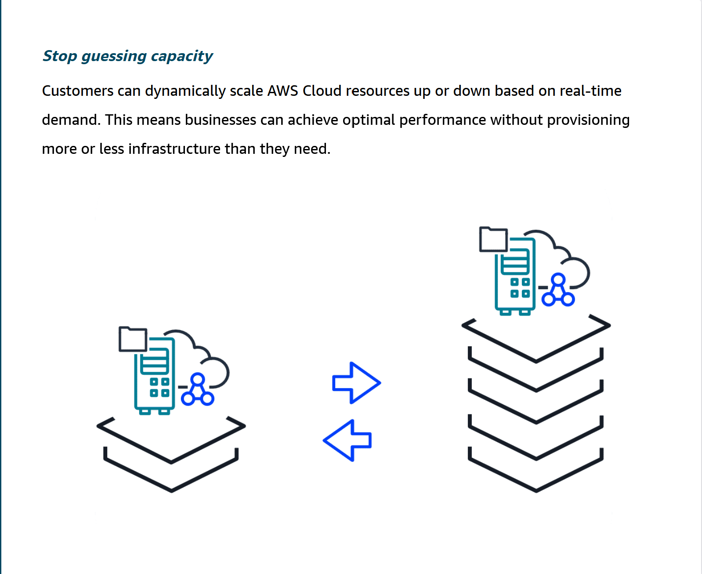
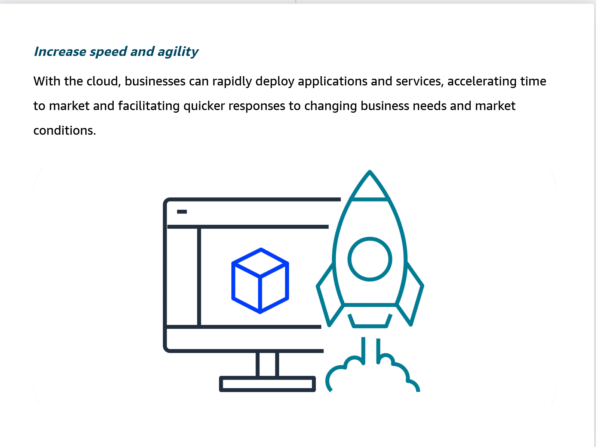
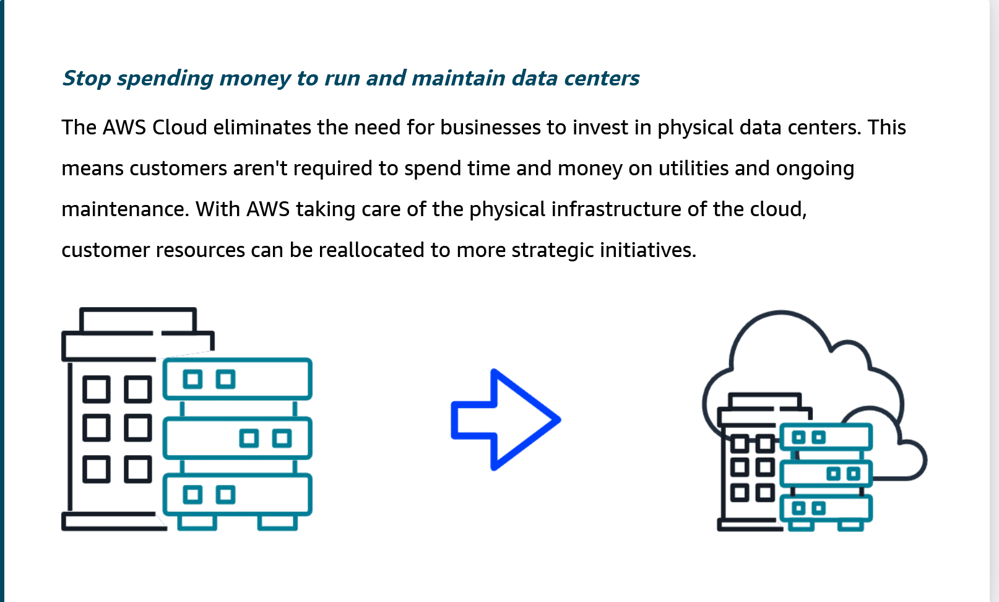
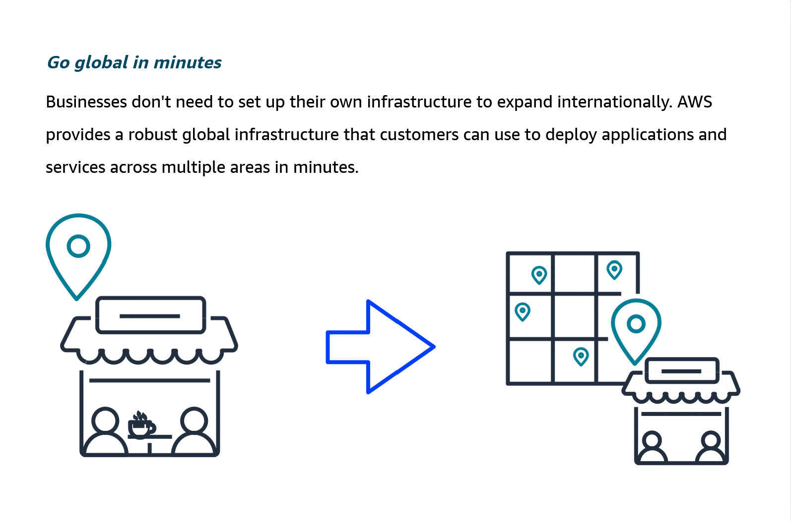

## Benefits of Cloud Computing

   Benefit #1: Trade fixed expense for variable expense.
   

   Benefit #2: Benefit from massive economies at scale.
   

   Benefit #3: Stpo guessing capacity.
   

   Benefit #4: Increase speed and agility.
   

   Benefit #5: Stop spending money maintaining and running data centers.
   

   Benefit #6: Go global in minutes.
   

